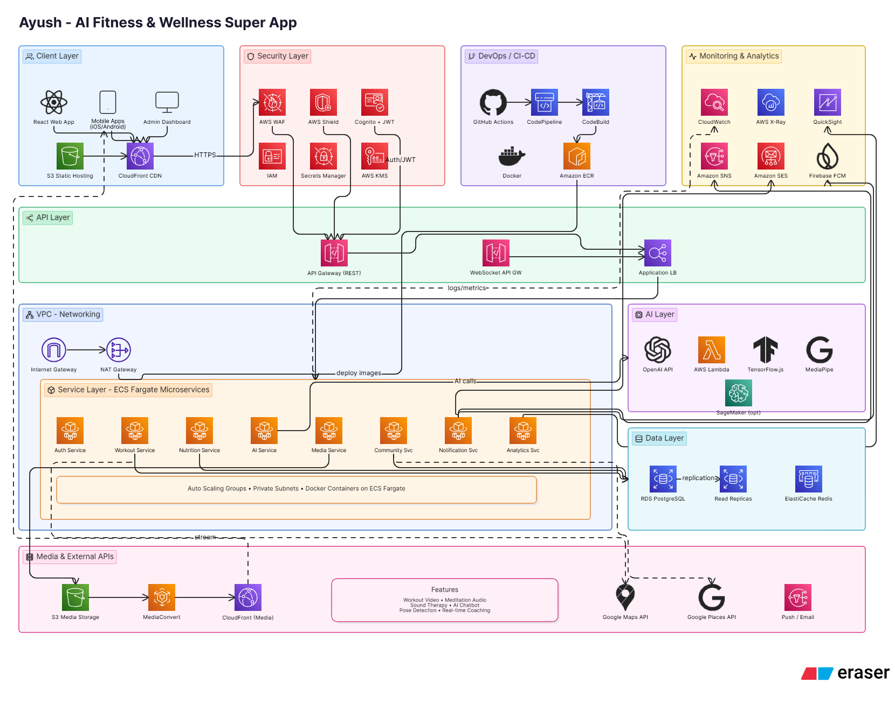

# STEP-BY-STEP AWS DEPLOYMENT FLOW FOR “AUSH”

This is the complete real-world deployment flow for building and deploying the **Aush AI Fitness & Wellness Super App** using AWS.

The process is organized exactly how a startup engineering team would build it.

------

# PHASE 1 — PROJECT PLANNING & ARCHITECTURE

## Step 1 — Finalize Product Scope

Define:

- Features
- User flows
- AI integrations
- Subscription model
- APIs
- Database entities
- Video streaming strategy
- Wellness modules
- Admin features

Deliverables:

- PRD (Product Requirement Document)
- User stories
- Wireframes
- Feature roadmap

------

## Step 2 — Design System Architecture

Create:

- AWS architecture
- Microservices architecture
- Database architecture
- Media architecture
- AI architecture
- Security architecture

Tools:

- Eraser.io
- Draw.io
- Figma

------

# PHASE 2 — UI/UX DESIGN

## Step 3 — Design UI in Figma

Design all screens:

- Splash
- Login
- Dashboard
- Workout pages
- Meditation
- Zumba
- AI chat
- Community
- Admin dashboard

Create:

- Design system
- Typography
- Color palette
- Components

------

# PHASE 3 — SETUP DEVELOPMENT ENVIRONMENT

## Step 4 — Create GitHub Repositories

Create repos:

### Frontend

```
aush-frontend
```

### Backend

```
aush-backend
```

### Infrastructure

```
aush-devops
```

------

## Step 5 — Setup Frontend Project

### Recommended Stack

- React + Vite
- TypeScript
- TailwindCSS
- shadcn/ui
- Zustand
- React Query

### Setup

```
npm create vite@latest
```

Install:

```
npm install tailwindcss react-router-dom zustand axios
```

------

## Step 6 — Setup Backend Project

### Stack

- Node.js
- Express.js
- Prisma
- PostgreSQL
- Redis

### Setup

```
mkdir aush-backend
npm init -y
```

Install:

```
npm install express prisma @prisma/client jsonwebtoken bcrypt cors dotenv
```

------

# PHASE 4 — AWS ACCOUNT SETUP

## Step 7 — Create AWS Account Structure

Create:

- Production account
- Staging account
- Development account

Recommended:

- AWS Organizations

------

## Step 8 — Configure IAM Users & Roles

Create:

### Roles

- Admin role
- DevOps role
- Backend deployment role
- Frontend deployment role

Enable:

- MFA
- Least privilege access

------

# PHASE 5 — DATABASE SETUP

## Step 9 — Create PostgreSQL Database

Use:

## Amazon RDS PostgreSQL

Create:

- Multi-AZ database
- Read replicas
- Automated backups

Database example:

```
aush-production-db
```

------

## Step 10 — Setup Prisma ORM

Initialize Prisma:

```
npx prisma init
```

Connect database:

```
DATABASE_URL=""
```

Run migrations:

```
npx prisma migrate dev
```

------

# PHASE 6 — REDIS CACHE SETUP

## Step 11 — Create Redis Cluster

Use:

## Amazon ElastiCache Redis

Used for:

- Session cache
- AI cache
- Trending workouts
- API optimization

------

# PHASE 7 — AUTHENTICATION SYSTEM

## Step 12 — Configure Amazon Cognito

Create:

- User pool
- App client
- Hosted UI

Enable:

- Google login
- Apple login
- OTP verification

Frontend integrates with:

- JWT tokens
- Refresh tokens

------

# PHASE 8 — MEDIA STORAGE SYSTEM

## Step 13 — Create S3 Buckets

Buckets:

```
aush-videos
aush-audio
aush-images
aush-user-uploads
```

Enable:

- Versioning
- Lifecycle rules
- Encryption

------

## Step 14 — Configure CloudFront CDN

Connect:

- S3 buckets
- Static frontend hosting

Optimizations:

- Global caching
- Video streaming acceleration

------

# PHASE 9 — VIDEO STREAMING SYSTEM

## Step 15 — Configure AWS MediaConvert

Used for:

- Adaptive bitrate streaming
- Compression
- Multi-resolution videos

Flow:

```
Upload Video → S3 → MediaConvert → CloudFront
```

------

# PHASE 10 — BACKEND DEPLOYMENT

## Step 16 — Dockerize Backend

Create:

```
Dockerfile
```

Build image:

```
docker build -t aush-backend .
```

------

## Step 17 — Push Docker Image to ECR

Create ECR repository:

```
aush-backend-repo
```

Push image:

```
docker push
```

------

## Step 18 — Deploy Backend to ECS Fargate

Create:

- ECS cluster
- ECS service
- Task definitions

Attach:

- Load balancer
- Auto scaling

------

# PHASE 11 — FRONTEND DEPLOYMENT

## Step 19 — Build Frontend

```
npm run build
```

------

## Step 20 — Deploy Frontend to S3

Upload build files:

```
aws s3 sync dist/ s3://aush-frontend
```

------

## Step 21 — Configure CloudFront

Setup:

- HTTPS
- Caching
- Compression

Connect domain:

```
app.aush.com
```

------

# PHASE 12 — AI SYSTEM DEPLOYMENT

## Step 22 — Setup OpenAI API

Store keys in:

## AWS Secrets Manager

Backend calls:

- AI chatbot
- Workout planner
- Nutrition AI

------

## Step 23 — Setup AI Pose Detection

Use:

- TensorFlow.js
- MediaPipe

Can run:

- On device
   OR
- On backend inference service

------

# PHASE 13 — REAL-TIME FEATURES

## Step 24 — Configure WebSocket APIs

Use:

- API Gateway WebSocket

Supports:

- Live workouts
- AI trainer
- Chat

------

# PHASE 14 — NOTIFICATIONS

## Step 25 — Configure Push Notifications

Use:

- Firebase Cloud Messaging

Backend triggers:

- Workout reminders
- Meditation reminders

------

## Step 26 — Configure Email Service

Use:

- Amazon SES

Supports:

- OTP emails
- Reports
- Subscription emails

------

# PHASE 15 — SECURITY SETUP

## Step 27 — Configure AWS WAF

Protect:

- APIs
- Load balancer

Rules:

- SQL injection protection
- Rate limiting

------

## Step 28 — Setup Secrets Manager

Store:

- DB credentials
- OpenAI keys
- JWT secrets

------

# PHASE 16 — CI/CD PIPELINE

## Step 29 — Setup GitHub Actions

Create workflows:

### Frontend workflow

```
build → test → deploy
```

### Backend workflow

```
build → dockerize → push → deploy ECS
```

------

## Step 30 — Configure AWS CodePipeline

Automate:

- Production deployment
- Rollbacks
- Staging deployments

------

# PHASE 17 — OBSERVABILITY & MONITORING

## Step 31 — Configure CloudWatch

Monitor:

- API latency
- Errors
- ECS logs
- AI requests

------

## Step 32 — Setup AWS X-Ray

Trace:

- API performance
- Microservices

------

# PHASE 18 — DOMAIN & SSL

## Step 33 — Purchase Domain

Example:

```
aush.com
```

Use:

- Route53

------

## Step 34 — Configure SSL Certificates

Use:

- AWS Certificate Manager

Enable:

- HTTPS everywhere

------

# PHASE 19 — MOBILE APP DEPLOYMENT

## Step 35 — Build Mobile Apps

Using:

- React Native Expo

Generate:

- Android APK/AAB
- iOS IPA

------

## Step 36 — Publish Apps

### Android

- Google Play Console

### iOS

- Apple App Store Connect

------

# PHASE 20 — SCALING & OPTIMIZATION

## Step 37 — Enable Auto Scaling

Scale:

- ECS services
- Databases

Based on:

- CPU
- Memory
- Requests

------

## Step 38 — Optimize Media Delivery

Use:

- CloudFront caching
- Lazy loading
- Video chunking

------

# PHASE 21 — ANALYTICS & AI IMPROVEMENTS

## Step 39 — Setup Analytics

Use:

- QuickSight
- Mixpanel
- Amplitude

Track:

- User retention
- Workout completion
- Wellness engagement

------

## Step 40 — AI Recommendation Engine

Train:

- Workout recommendations
- Meditation suggestions
- Meal plans

------

# FINAL PRODUCTION ARCHITECTURE FLOW

```
Users
   ↓
CloudFront CDN
   ↓
Frontend (React Web + Mobile)
   ↓
API Gateway
   ↓
Load Balancer
   ↓
ECS Fargate Microservices
   ↓
Redis Cache
   ↓
RDS PostgreSQL
   ↓
S3 Media Storage
   ↓
MediaConvert
   ↓
CloudFront Streaming
   ↓
OpenAI + AI Services
```

------

# RECOMMENDED MVP DEPLOYMENT ORDER

## FIRST BUILD

1. Authentication
2. Dashboard
3. Workout system
4. Nutrition system
5. Video streaming
6. AI chatbot

------

## SECOND RELEASE

1. Meditation
2. Sound therapy
3. Community
4. Maps
5. Notifications

------

## THIRD RELEASE

1. AI pose detection
2. Live classes
3. Smartwatch integration
4. AI body scan
5. Advanced analytics

------

# BEST AWS SERVICES FOR MVP

| Feature          | AWS Service       |
| ---------------- | ----------------- |
| Frontend Hosting | S3 + CloudFront   |
| Backend          | ECS Fargate       |
| Database         | RDS PostgreSQL    |
| Cache            | ElastiCache Redis |
| Auth             | Cognito           |
| Video Storage    | S3                |
| CDN              | CloudFront        |
| AI Secrets       | Secrets Manager   |
| Monitoring       | CloudWatch        |
| Notifications    | SNS + SES         |

------

# RECOMMENDED COST-EFFICIENT MVP SETUP

Start with:

- ECS Fargate
- Single RDS instance
- Small Redis cluster
- CloudFront CDN
- S3 media
- Open AI API

Then scale gradually.




